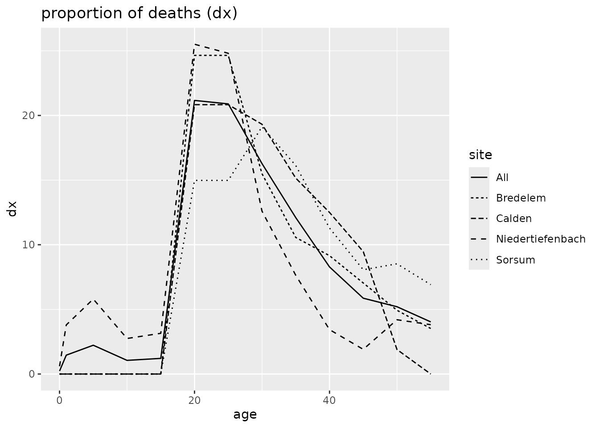
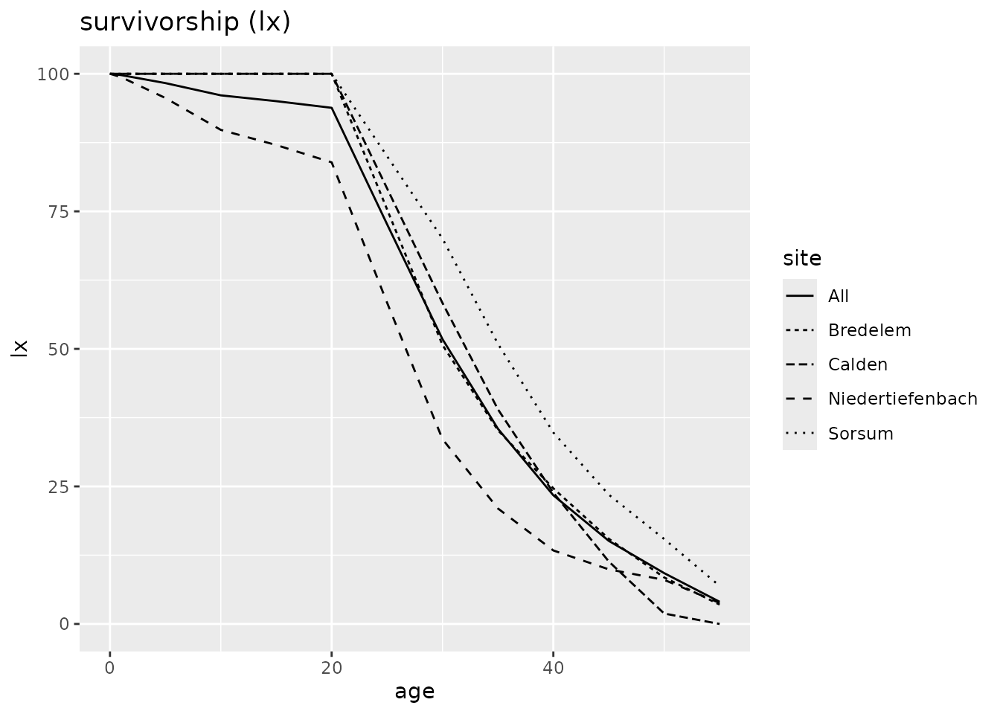
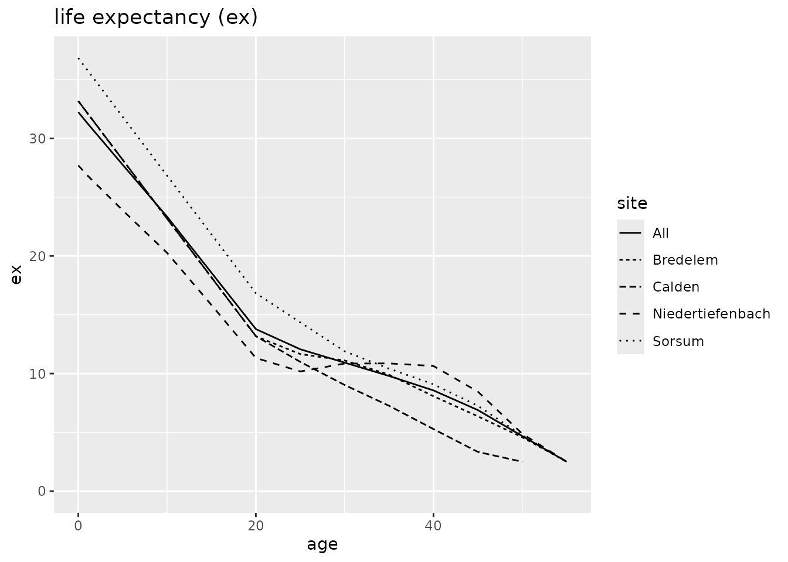
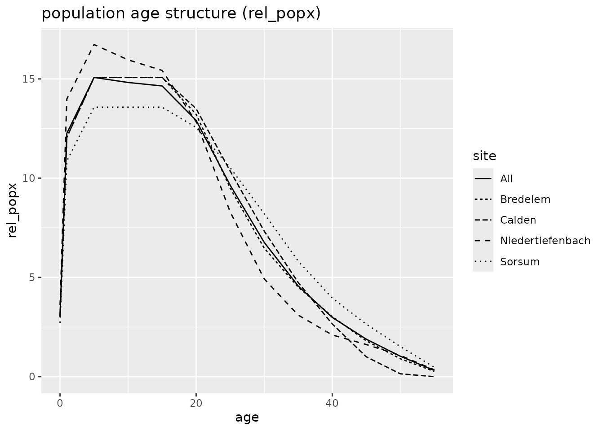

# Example: Neolithic Gallery graves

## Load libraries

``` r
library(mortAAR)
library(magrittr)
```

## Make test data available

Data from four neolithic gallery graves in central Germany (Czarnetzki
1966).

``` r
td <- gallery_graves
```

Inspect the data. Show the first ten rows of the data set:

| indnr | sex | age   | site             |
|:------|:----|:------|:-----------------|
| 2     | m   | 20-30 | Niedertiefenbach |
| 7     | m   | 20-30 | Niedertiefenbach |
| 9     | m   | 40-50 | Niedertiefenbach |
| 9t    | m   | 50-60 | Niedertiefenbach |
| 23    | m   | 20-30 | Niedertiefenbach |
| 30    | m   | 20-30 | Niedertiefenbach |
| 39    | m   | 20-30 | Niedertiefenbach |
| 45    | m   | 20-30 | Niedertiefenbach |
| 58    | m   | 30-40 | Niedertiefenbach |
| 69    | m   | 20-30 | Niedertiefenbach |

## Clean up data

Replace: “?” with `NA` values.

``` r
td %>% replace(td == "?", NA) -> td
```

| indnr | sex | age   | site             |
|:------|:----|:------|:-----------------|
| 2     | m   | 20-30 | Niedertiefenbach |
| 7     | m   | 20-30 | Niedertiefenbach |
| 9     | m   | 40-50 | Niedertiefenbach |
| 9t    | m   | 50-60 | Niedertiefenbach |
| 23    | m   | 20-30 | Niedertiefenbach |
| 30    | m   | 20-30 | Niedertiefenbach |
| 39    | m   | 20-30 | Niedertiefenbach |
| 45    | m   | 20-30 | Niedertiefenbach |
| 58    | m   | 30-40 | Niedertiefenbach |
| 69    | m   | 20-30 | Niedertiefenbach |

Translate “inf_I”, “inf_I” and “juv” into numeric age ranges (Martin
1928, 580).

``` r
td <- td %>% 
  replace(td == "inf_I",  "0-6") %>%
  replace(td == "inf_II", "7-13") %>%
  replace(td == "juv",    "14-19")
```

| indnr | sex | age   | site             |
|:------|:----|:------|:-----------------|
| 2     | m   | 20-30 | Niedertiefenbach |
| 7     | m   | 20-30 | Niedertiefenbach |
| 9     | m   | 40-50 | Niedertiefenbach |
| 9t    | m   | 50-60 | Niedertiefenbach |
| 23    | m   | 20-30 | Niedertiefenbach |
| 30    | m   | 20-30 | Niedertiefenbach |
| 39    | m   | 20-30 | Niedertiefenbach |
| 45    | m   | 20-30 | Niedertiefenbach |
| 58    | m   | 30-40 | Niedertiefenbach |
| 69    | m   | 20-30 | Niedertiefenbach |

Remove rows that do not have age information.

``` r
td <- td %>%
  dplyr::filter(!is.na(age))
```

| indnr | sex | age   | site             |
|:------|:----|:------|:-----------------|
| 2     | m   | 20-30 | Niedertiefenbach |
| 7     | m   | 20-30 | Niedertiefenbach |
| 9     | m   | 40-50 | Niedertiefenbach |
| 9t    | m   | 50-60 | Niedertiefenbach |
| 23    | m   | 20-30 | Niedertiefenbach |
| 30    | m   | 20-30 | Niedertiefenbach |
| 39    | m   | 20-30 | Niedertiefenbach |
| 45    | m   | 20-30 | Niedertiefenbach |
| 58    | m   | 30-40 | Niedertiefenbach |
| 69    | m   | 20-30 | Niedertiefenbach |

Make a decision on individual 139 from Niedertiefenbach with age less or
equal 60.

``` r
td[td$indnr == "139" & td$site == "Niedertiefenbach", ]$age <- "50-60"
```

| indnr | sex | age   | site             |
|:------|:----|:------|:-----------------|
| 2     | m   | 20-30 | Niedertiefenbach |
| 7     | m   | 20-30 | Niedertiefenbach |
| 9     | m   | 40-50 | Niedertiefenbach |
| 9t    | m   | 50-60 | Niedertiefenbach |
| 23    | m   | 20-30 | Niedertiefenbach |
| 30    | m   | 20-30 | Niedertiefenbach |
| 39    | m   | 20-30 | Niedertiefenbach |
| 45    | m   | 20-30 | Niedertiefenbach |
| 58    | m   | 30-40 | Niedertiefenbach |
| 69    | m   | 20-30 | Niedertiefenbach |

Separate the age range column.

``` r
td <- td %>%
  tidyr::separate(age, c("from", "to"))
```

    ## Warning: Expected 2 pieces. Missing pieces filled with `NA` in 1 rows
    ## [35].

| indnr | sex | from | to  | site             |
|:------|:----|:-----|:----|:-----------------|
| 2     | m   | 20   | 30  | Niedertiefenbach |
| 7     | m   | 20   | 30  | Niedertiefenbach |
| 9     | m   | 40   | 50  | Niedertiefenbach |
| 9t    | m   | 50   | 60  | Niedertiefenbach |
| 23    | m   | 20   | 30  | Niedertiefenbach |
| 30    | m   | 20   | 30  | Niedertiefenbach |
| 39    | m   | 20   | 30  | Niedertiefenbach |
| 45    | m   | 20   | 30  | Niedertiefenbach |
| 58    | m   | 30   | 40  | Niedertiefenbach |
| 69    | m   | 20   | 30  | Niedertiefenbach |

Adjust variable types.

``` r
td <- td %>%
  transform(
    from = as.numeric(from),
    to = as.numeric(to)
  )
```

## Analysis preparation

Control the flow of the analysis by exemplifying what the different
variables of the input data stand for.

``` r
# tdlist <- td %>%
#   plyr::dlply("site", identity)

td_prepared <- prep.life.table(
  td, 
  dec = NA, 
  agebeg = "from",
  ageend = "to", 
  group = "site", 
  method = "Standard",
  agerange = "included"
)
```

## Analysis

``` r
td_result <- td_prepared %>%
  life.table()
```

## Plot

``` r
td_result %>% plot(display = c("qx", "dx", "lx"))
```

    ## Warning: Removed 1 row containing missing values or values outside the scale range
    ## (`geom_line()`).



``` r
td_result %>% plot(display = c("ex", "rel_popx"))
```

    ## Warning: Removed 1 row containing missing values or values outside the scale range
    ## (`geom_line()`).



## References

Czarnetzki, A. 1966. “Die Menschlichen Skelettreste Aus Vier
Neolithischen Steinkisten Hessens Und Niedersachsens.” Dissertation.
Tuebingen.

Martin, Rudolf. 1928. *Lehrbuch der Anthropologie in systematischer
Darstellung. Mit besonderer Beruecksichtigung der anthropologischen
Methoden. Band 2: Kraniologie.* 2. ed. Jena: G. Fischer.
<https://doi.org/10.11588/diglit.37612>.
