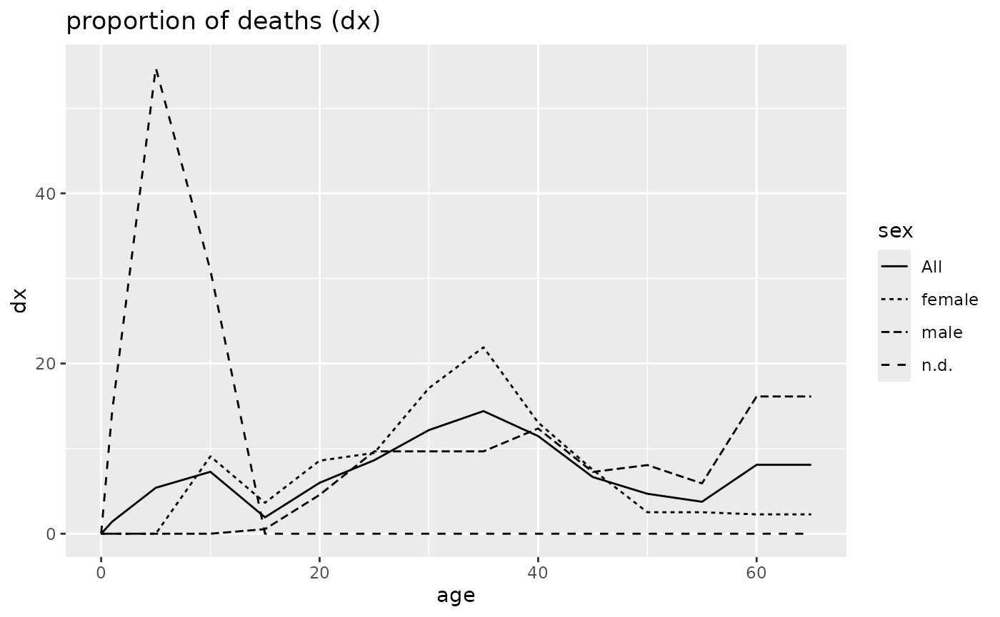
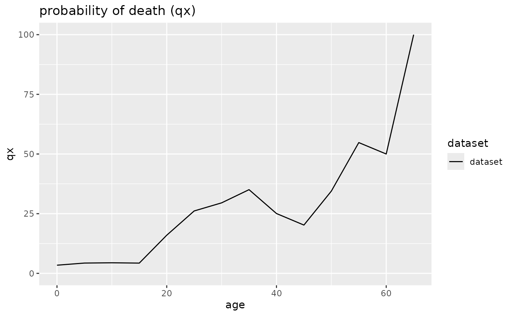

# Example: European Iron Age

## Münsingen

### Archaeological background

The cemetery of Münsingen-Rain was discovered in 1904 during quarrying
and then extensively excavated in 1906. The dead were buried singly and
supine in wodden coffins, often lavishly equipped with jewelry or
weapons. The documentation and subsequent publication of the graves in
1908 (Wiedmer-Stern 1908) was outstanding for that time. This and the
fact that Münsingen-Rain with 220–230 individuals and its occupation of
roughly 300 years covers much of the Latène period secured it one of the
most important places in typological and chronological studies of that
period (Hodson 1968; see also Mueller 1998).

Recently, in a number of studies, the anthropological and archaeological
material has been reanalysed from different angles (Jud 1998; Alt,
Mueller, and Jud 2005; Mueller, Alt, and Jud 2008; Scheeres et al.
in_press; Moghaddam et al. 2016). Though some papers explicitly dealt
with the age and sex structure of the cemetery (e.g., Hinton 1986; Jud
1998, 125ff.), interestingly, none has yet presented a thorough
demographic analysis of the individuals from Münsingen-Rain.

### The data set

The data originates from a published report of recent scientific
analyses of the surviving skeletal material (Moghaddam et al. 2016) of
71 individuals. The data is available as supplemental online material
and was directly taken from the respective xlsx-file. Beside the
age-range of each individuals the sex, the archaeological phase and the
binary information if grave goods, if existing, are included. Further
columns that are not of interest in the present context were omitted.
The authors do not compare their results with those of an older
investigation of the same individuals. However, a comparison with Hug
(1956) shows that generally there is a very good agreement in age as
well as sex determination.

### Constructing the life table

``` r
# load package dependencies
library(mortAAR)
library(magrittr)
```

``` r
# load dataset muensingen
muen <- mortAAR::muensingen  
```

First of all, we have to get an overview of the age classes that were
used. The easiest way would be `muen$age`. However, this results in
roughly formatted row of strings. We used the following code to get an
ordered and well-arranged list without duplicated age classes.

``` r
muen %>% dplyr::select(age) %>% dplyr::arrange(nchar(age), age) %>% unique()
```

    ##         age
    ## A52      10
    ## A50     3-5
    ## A55     7-8
    ## A51     7-9
    ## A57     >50
    ## A58     >60
    ## A61    9-10
    ## A48   12-14
    ## A63   12-15
    ## A102  13-15
    ## A43   15-20
    ## A99   18-28
    ## A47   18-30
    ## A101  20-26
    ## A62   20-30
    ## A59   20-40
    ## A74   25-35
    ## A83   25-40
    ## A53   25-45
    ## A44   30-40
    ## A84   30-45
    ## A70   30-50
    ## A85   34-50
    ## A60   35-45
    ## A73   35-50
    ## A89   40-50
    ## A78   40-55
    ## A98   40-60
    ## A72   45-60
    ## A71   50-70
    ## A45  10+/-1

As can be easily seen, the data set is comprised of 31 different age
ranges. Skimming through the lines it is obvious that the
anthropologists were not completely consequent in their age ranges.
While „20–40“ clearly should be read as „from 20 to 39 years“ this is
certainly not the case with for example „7–8“. The first one is in our
terminology exclusive of the maximal age range, the second inclusive.
Less clear are cases like „12–14“ or „13–15“. If we want to define
5-year-classes the differentiation does not really matter in the first
case, as the individual would fall completely in the age range of 10 to
14. In the second case, the differentiation is unfortunately of
importance. Taking it as inclusive, the individual would count with 1/4
to the age class of 15 to 19 while reading it as exclusive the
individual would be associated with the younger age class.

Unfortunately, we cannot solve this issue but for future reports we can
only ask the authors to be more precise in their terminology. For the
sake of the example, we assumed that age ranges only one year apart
(e.g., „7-8“) are meant as inclusive and had to be adapted, but
otherwise treated the age ranges as exclusive. For those individuals
with an open end, we assume a maximal age of 70.

In the next step, not only the aforementioned inconsistencies have to be
corrected, but also non-numerical characters (e.g., “\>”) must be
replaced to be able to feed the data into mortAAR.

``` r
# correct inconsistencies
muen <- muen %>%
  dplyr::mutate(
    age = dplyr::case_when(
      .$age == ">50"    ~ "50-70",
      .$age == ">60"    ~ "60-70",
      .$age == "10+/-1" ~ "9-12",
      .$age == "10"     ~ "10-11",
      .$age == "7-8"    ~ "7-9",
      .$age == "9-10"   ~ "9-11",
      TRUE            ~  .$age
    )
  )
```

After adjusting the age class categories, the column “age” can be split
into two separate columns “from” and “to”, which mark the age span.
These are then further transformed into numeric columns.

``` r
# split string column
muen <- muen %>% 
  tidyr::separate(age, c("from", "to")) %>%  
  transform(from = as.numeric(from), to = as.numeric(to))  
```

All the steps above were necessary to prepare the raw data. We are now
ready to feed it into the function `prep.life.table` that rearranges it
for the actual life table function.  
We want to have 5-year-age categories, except for the first 5 years
which are further split into the first and the subsequent 4 years.
Therefore, we choose “Standard” as a `method`. As explained above, we
assume that the age ranges are meant to be exclusive of the closing year
(e.g., “20–40” as “20–39”). We regulate this by choosing “excluded” for
`agerange`. The beginning and ending of the age classes is framed by
“from” (= `agebeg`) and “to” (= `ageend`) respectively. For the first
run, we choose “sex” as the grouping variable `group` but we could also
have selected “latene_phase” (the archaeological phasing) or
“grave_goods” (existence or non-existence of grave goods).

``` r
# apply data preparation function 
muen_prep <- muen %>% 
    prep.life.table(
    group = "sex", 
    agebeg = "from", 
    ageend = "to", 
    method = "Standard", 
    agerange = "excluded" 
  )  
```

The resulting data frame `muen_prep` is then fed into the life table
function `life.table`.

``` r
# calculate life.table
muen_result <- muen_prep %>% 
  life.table() 
```

First, the tabular output is created.

``` r
muen_result 
```

    ## 
    ## 
    ##   mortAAR life table for sex: female (n = 33 individuals)
    ## 
    ## Life expectancy at birth (e0): 34.946
    ## 
    ##         x a    Ax    Dx     dx      lx      qx      Lx       Tx     ex rel_popx
    ## 1    0--0 1 0.333 0.000  0.000 100.000   0.000 100.000 3494.571 34.946    2.862
    ## 2    1--4 4 1.333 0.000  0.000 100.000   0.000 400.000 3394.571 33.946   11.446
    ## 3    5--9 5 2.500 0.000  0.000 100.000   0.000 500.000 2994.571 29.946   14.308
    ## 4  10--14 5 2.500 3.000  9.091 100.000   9.091 477.273 2494.571 24.946   13.658
    ## 5  15--19 5 2.500 1.200  3.636  90.909   4.000 445.455 2017.298 22.190   12.747
    ## 6  20--24 5 2.500 2.833  8.586  87.273   9.838 414.899 1571.843 18.011   11.873
    ## 7  25--29 5 2.500 3.133  9.495  78.687  12.067 369.697 1156.944 14.703   10.579
    ## 8  30--34 5 2.500 5.646 17.109  69.192  24.726 303.188  787.247 11.378    8.676
    ## 9  35--39 5 2.500 7.229 21.907  52.083  42.061 205.650  484.059  9.294    5.885
    ## 10 40--44 5 2.500 4.313 13.068  30.177  43.305 118.213  278.409  9.226    3.383
    ## 11 45--49 5 2.500 2.479  7.513  17.109  43.911  66.761  160.196  9.363    1.910
    ## 12 50--54 5 2.500 0.833  2.525   9.596  26.316  41.667   93.434  9.737    1.192
    ## 13 55--59 5 2.500 0.833  2.525   7.071  35.714  29.040   51.768  7.321    0.831
    ## 14 60--64 5 2.500 0.750  2.273   4.545  50.000  17.045   22.727  5.000    0.488
    ## 15 65--69 5 2.500 0.750  2.273   2.273 100.000   5.682    5.682  2.500    0.163
    ## 
    ##   mortAAR life table for sex: n.d. (n = 7 individuals)
    ## 
    ## Life expectancy at birth (e0): 8.31
    ## 
    ##         x a    Ax    Dx     dx      lx      qx      Lx      Tx    ex rel_popx
    ## 1    0--0 1 0.333 0.000  0.000 100.000   0.000 100.000 830.952 8.310   12.034
    ## 2    1--4 4 1.333 1.000 14.286 100.000  14.286 361.905 730.952 7.310   43.553
    ## 3    5--9 5 2.500 3.833 54.762  85.714  63.889 291.667 369.048 4.306   35.100
    ## 4  10--14 5 2.500 2.167 30.952  30.952 100.000  77.381  77.381 2.500    9.312
    ## 5  15--19 5 2.500 0.000  0.000   0.000     NaN   0.000   0.000   NaN    0.000
    ## 6  20--24 5 2.500 0.000  0.000   0.000     NaN   0.000   0.000   NaN    0.000
    ## 7  25--29 5 2.500 0.000  0.000   0.000     NaN   0.000   0.000   NaN    0.000
    ## 8  30--34 5 2.500 0.000  0.000   0.000     NaN   0.000   0.000   NaN    0.000
    ## 9  35--39 5 2.500 0.000  0.000   0.000     NaN   0.000   0.000   NaN    0.000
    ## 10 40--44 5 2.500 0.000  0.000   0.000     NaN   0.000   0.000   NaN    0.000
    ## 11 45--49 5 2.500 0.000  0.000   0.000     NaN   0.000   0.000   NaN    0.000
    ## 12 50--54 5 2.500 0.000  0.000   0.000     NaN   0.000   0.000   NaN    0.000
    ## 13 55--59 5 2.500 0.000  0.000   0.000     NaN   0.000   0.000   NaN    0.000
    ## 14 60--64 5 2.500 0.000  0.000   0.000     NaN   0.000   0.000   NaN    0.000
    ## 15 65--69 5 2.500 0.000  0.000   0.000     NaN   0.000   0.000   NaN    0.000
    ## 
    ##   mortAAR life table for sex: male (n = 31 individuals)
    ## 
    ## Life expectancy at birth (e0): 47.863
    ## 
    ##         x a    Ax    Dx     dx      lx      qx      Lx       Tx     ex rel_popx
    ## 1    0--0 1 0.333 0.000  0.000 100.000   0.000 100.000 4786.290 47.863    2.089
    ## 2    1--4 4 1.333 0.000  0.000 100.000   0.000 400.000 4686.290 46.863    8.357
    ## 3    5--9 5 2.500 0.000  0.000 100.000   0.000 500.000 4286.290 42.863   10.447
    ## 4  10--14 5 2.500 0.000  0.000 100.000   0.000 500.000 3786.290 37.863   10.447
    ## 5  15--19 5 2.500 0.167  0.538 100.000   0.538 498.656 3286.290 32.863   10.418
    ## 6  20--24 5 2.500 1.417  4.570  99.462   4.595 485.887 2787.634 28.027   10.152
    ## 7  25--29 5 2.500 3.000  9.677  94.892  10.198 450.269 2301.747 24.256    9.407
    ## 8  30--34 5 2.500 3.000  9.677  85.215  11.356 401.882 1851.478 21.727    8.397
    ## 9  35--39 5 2.500 3.000  9.677  75.538  12.811 353.495 1449.597 19.190    7.386
    ## 10 40--44 5 2.500 3.833 12.366  65.860  18.776 298.387 1096.102 16.643    6.234
    ## 11 45--49 5 2.500 2.250  7.258  53.495  13.568 249.328  797.715 14.912    5.209
    ## 12 50--54 5 2.500 2.500  8.065  46.237  17.442 211.022  548.387 11.860    4.409
    ## 13 55--59 5 2.500 1.833  5.914  38.172  15.493 176.075  337.366  8.838    3.679
    ## 14 60--64 5 2.500 5.000 16.129  32.258  50.000 120.968  161.290  5.000    2.527
    ## 15 65--69 5 2.500 5.000 16.129  16.129 100.000  40.323   40.323  2.500    0.842
    ## 
    ##   mortAAR life table for sex: All (n = 71 individuals)
    ## 
    ## Life expectancy at birth (e0): 37.96
    ## 
    ##         x a    Ax     Dx     dx      lx      qx      Lx       Tx     ex rel_popx
    ## 1    0--0 1 0.333  0.000  0.000 100.000   0.000 100.000 3795.951 37.960    2.634
    ## 2    1--4 4 1.333  1.000  1.408 100.000   1.408 396.244 3695.951 36.960   10.439
    ## 3    5--9 5 2.500  3.833  5.399  98.592   5.476 479.460 3299.707 33.468   12.631
    ## 4  10--14 5 2.500  5.167  7.277  93.192   7.809 447.770 2820.246 30.263   11.796
    ## 5  15--19 5 2.500  1.367  1.925  85.915   2.240 424.765 2372.477 27.614   11.190
    ## 6  20--24 5 2.500  4.250  5.986  83.991   7.127 404.988 1947.711 23.190   10.669
    ## 7  25--29 5 2.500  6.133  8.638  78.005  11.074 368.427 1542.723 19.777    9.706
    ## 8  30--34 5 2.500  8.646 12.177  69.366  17.555 316.388 1174.296 16.929    8.335
    ## 9  35--39 5 2.500 10.229 14.407  57.189  25.192 249.927  857.908 15.001    6.584
    ## 10 40--44 5 2.500  8.146 11.473  42.782  26.818 185.226  607.981 14.211    4.880
    ## 11 45--49 5 2.500  4.729  6.661  31.309  21.275 139.891  422.755 13.503    3.685
    ## 12 50--54 5 2.500  3.333  4.695  24.648  19.048 111.502  282.864 11.476    2.937
    ## 13 55--59 5 2.500  2.667  3.756  19.953  18.824  90.376  171.362  8.588    2.381
    ## 14 60--64 5 2.500  5.750  8.099  16.197  50.000  60.739   80.986  5.000    1.600
    ## 15 65--69 5 2.500  5.750  8.099   8.099 100.000  20.246   20.246  2.500    0.533

The visual inspection can be of great help, especially when the
comparison of two or more groups is involved.

``` r
muen_result %>% 
  plot(display = c("dx","qx", "lx", "ex", "rel_popx"))  
```



    ## Warning: Removed 11 rows containing missing values or values outside the scale range (`geom_line()`).


    ## Warning: Removed 11 rows containing missing values or values outside the scale range (`geom_line()`).


### Mortality patterns

The maximum within the proportion of deaths (dx) of all individuals from
Münsingen-Rain is around 40 years. Largely missing are younger
individuals below 20, but also the age of 50 and above is only slightly
present. Especially the apparent lack of the subadult individuals
generates questions concerning the representation of the data. Already a
superficial look at any modern life tables leads to the expectation of
far higher numbers of younger individuals. Therefore, the obvious
conclusion seems that not everybody was buried within the cemetery.

However, there are also differences between the adult individuals. The
maximum in females was in their 40s, while male individuals apparently
died somehow later in their 50s. There are virtually no female
individuals older than 55, but many males above 60. Accordingly female
individuals suffered a much higher probability of death (qx), had less
survivorship (lx) within all age categories. The life expectancy differs
as much as nearly 13 years (35.0 for females vs. 47.9 for males), but
this is also due to the fact that it was obviously possible to sex six
subadult females, but nearly no subadult males.

As a result the analysis leaves more open questions than answers:
Representation is obviously not given, as is demonstrated by the largely
missing subadult individuals. However, even with adult individuals, the
highly differing mortality pattern between males and females elicits the
question if this was really due to the differing life expectancy or
differing cultural preferences in burying males and females.

We invite the reader to regroup the data with the variables
“latene_phase” and “grave_goods” and compare her results with the
conclusions by P. Hinton (1986).

## Magdalenenberg

### Archaeological Background

One of the largest burial mounds in Central Europe is the so-called
[’Magdalenenberg‘](https://en.wikipedia.org/wiki/Magdalenenberg) near
Villingen-Schwenningen in Baden-Württemberg. Within the Early Iron Age
it dates into the beginning of the Upper Hallstatt Period (c. 620–450
calBC). It had a diameter of over 100 metres and has still a height of
6,5 metres. For complete excavation 45000 cubic metres of earth and
stone had to be moved. The first excavations took place in 1887 and 1890
and are in an excellent state of preservation. A modern excavation was
done between 1970 and 1973 by Konrad Spindler.

The central grave was probably erected in 616 BC, as established by
dendrochronology (Billamboz and Neyses 1999); it had already been
reopened in ancient times, but the wooden chamber was still in pristine
condition when excavated. Furthermore, more than 100 additional burials
were found which were dug into the burial mound a relatively short
period after the installation of the central grave. These proved to be
of great importance for relative chronology as well as for the social
interpretation of the Hallstatt period.

The importance of the ’Magdalenenberg‘ does not only derived from the
excellent preservation and the many burials that were uncovered, but
also from the fact that the excavator Spindler did not choose to wait
for the publication until everything was excavated or studied. He
started to publish the raw results already in 1971 when the excavation
was still under way. By 1980 all graves were published in six volumes
(Spindler 1971, 1972, 1973, 1976, 1977; 1980).

In recent years the anthropological material has been subjected to
stable isotope analyses (Oelze et al. 2012). In this context the whole
material was analysed again by established anthropological methods to
get more information on the age and sex of the deceased. This resulted
into a paper on the demographic structure of the population of
‘Magdalenenberg’ (Zaeuner and Wahl 2013). The new analyses were able to
specify the results in some respects done in the 1970s, but for the sake
of this paper it is important to emphasize that in general, they are
both congruent.

### The data set

The aforementioned paper (Zaeuner and Wahl 2013) provides a complete
table of the findings, but as this is very detailed, it is easier to
refer to the life table the authors generated. They refrained from
including an age range of 0–1, so we followed them in this. As explained
above, mortAAR allows this easily. For the oldest age, we assumed,
similar to Münsingen, a maximal age of 69 (because the age ranges are in
this case inclusive).

Because of one peculiarity their life table differs from the one mortAAR
generates: they estimated the lived years of the oldest age group, 4.72
individuals, with 0, which means that they assumed that the individuals
died after reaching their 60th birthday. This does not seem very
plausible to us, and we think that the result of mortAAR is more
realistic (average death in the middle of the age class). The
differences apply specifically to the sum of lived years (Lx) and thus
also to Tx, ex and the relative population measure (rel_popx).

### Constructing the life table

The preparing steps for the construction of the life table of the
population from ‘Magdalenenberg’ are less extensive than from
Münsingen-Rain because the data already came from a life table and is
thus better prepared.

``` r
mag <- magdalenenberg  
```

The only replacement necessary concerns the oldest age group.

``` r
mag <- mag %>% 
  replace(mag == "60-x", "60-69")  
```

``` r
mag <- mag %>% 
  tidyr::separate(a, c("from", "to")) %>%  
  transform(from = as.numeric(from), to = as.numeric(to))  
```

As `method` we choose this time “Equal5”. This way we get
5-year-intervals throughout, as in the original life table. The closing
year is meant to be counted as well, therefore `agerange` is set to
“included”. The biggest difference to the Münsingen example concerns the
number of deceased. Within the Münsingen data each line concerns one
individual, while within the Magdalenenberg data each line (= age range)
concerns more than one individual. This is why it is mandatory this time
to define `dec`. Because we analyze all individuals together, no
grouping variable is specified and therefore only one life table will be
computed.

``` r
mag_prep <- mag %>% 
  prep.life.table( 
    dec = "Dx", 
    agebeg = "from", 
    ageend = "to", 
    method = "Equal5",
    agerange = "included"
  )  
```

Finally, the prepared table is fed into the function `life.table`, and
the result printed as well as plotted.

``` r
mag_result <- mag_prep %>% 
  life.table()  

mag_result 
```

    ## 
    ##   mortAAR life table (n = 111 individuals)
    ## 
    ## Life expectancy at birth (e0): 32.196
    ## 
    ##         x a    Ax    Dx     dx      lx      qx      Lx       Tx     ex rel_popx
    ## 1    0--4 5 1.667  3.79  3.414 100.000   3.414 488.619 3219.632 32.196   15.176
    ## 2    5--9 5 2.500  4.62  4.162  96.586   4.309 472.523 2731.014 28.276   14.676
    ## 3  10--14 5 2.500  4.54  4.090  92.423   4.425 451.892 2258.491 24.436   14.036
    ## 4  15--19 5 2.500  4.21  3.793  88.333   4.294 432.185 1806.599 20.452   13.423
    ## 5  20--24 5 2.500 14.99 13.505  84.541  15.974 388.941 1374.414 16.257   12.080
    ## 6  25--29 5 2.500 20.61 18.568  71.036  26.138 308.761  985.473 13.873    9.590
    ## 7  30--34 5 2.500 17.20 15.495  52.468  29.533 223.604  676.712 12.897    6.945
    ## 8  35--39 5 2.500 14.39 12.964  36.973  35.063 152.455  453.108 12.255    4.735
    ## 9  40--44 5 2.500  6.68  6.018  24.009  25.066 105.000  300.653 12.523    3.261
    ## 10 45--49 5 2.500  4.04  3.640  17.991  20.230  80.856  195.653 10.875    2.511
    ## 11 50--54 5 2.500  5.49  4.946  14.351  34.463  59.392  114.797  7.999    1.845
    ## 12 55--59 5 2.500  5.72  5.153   9.405  54.789  34.144   55.405  5.891    1.060
    ## 13 60--64 5 2.500  2.36  2.126   4.252  50.000  15.946   21.261  5.000    0.495
    ## 14 65--69 5 2.500  2.36  2.126   2.126 100.000   5.315    5.315  2.500    0.165

For the purpose of this example, we limit the graphical output to the
proportion of deaths (dx), probability of death (qx) and life expectancy
(ex).

``` r
mag_result %>% 
  plot(display = c("dx","qx","ex"))  
```



### Mortality patterns

Very similar to the Münsingen example, the maximum within the proportion
of deaths (dx) of all individuals is in early grown up years, this time
around 30 years. Again, largely missing are younger individuals below
20, but also the age of 50 and above. Because of the lack of younger
individuals, life expectancy at birth is relatively high at 32.2 years.
Already observed by Zäuner and Wahl, the fact that life expectancy is
steadily declining from birth onwards is completely atypical.
Remarkable, but certainly an artefact due to the necessary artificial
age ranges, is the steep decline of the probability of death (qx) after
40 and 60, respectively.

## Comparing Early Iron Age (Magdalenenberg) and Middle/Late Iron Age (Münsingen-Rain)

As a last step for our analysis, we will compare the curves of the life
tables of the cemeteries from the ‘Magdalenenberg’ and Münsingen-Rain.

### Constructing the life table

The output of the function `prep.life.table` can be addressed separately
by their grouping names. We use this option to collect the results of
the above examples Münsingen-Rain and Magdalenenberg. For
‘Magdalenenberg’ with no grouping variable the name of the corresponding
`data.frame` within the list of results is “Deceased” by default.
Because we want to have comparable data from Münsingen-Rain we choose
the output for all individuals (`data.frame` named “All” by default).

``` r
comp <- list(mag_prep$Deceased, muen_prep$All)  
```

To have meaningful names for the graphical output, we change these.

``` r
names(comp) <- c("Magdalenenberg", "Muensingen")  
```

Again, the newly formed and renamed list is then fed into the function
`life.table`.

``` r
comp_result <- comp %>% 
  life.table()  
```

We can skip the tabular output because this has already been provided
above and go straight to the diagrams.

``` r
comp_result %>% 
  plot(display = c("dx","qx", "lx","ex"))  
```


### Mortality patterns

The similarities, but also the differences between the data sets are
striking. On the one hand, the general shape of the curves of the
probability of death (dx) is the same with very low values in the
younger and older age classes. By far the most prominent age group in
both data sets are the middle aged individuals. However, it seems that
the peak for the Magdalenenberg individuals are in the 30s, while for
the Münsingen population it is 10 years later. This difference is also
reflected in the other diagrams: The probability of death (qx) of the
Magdalenenberg individuals is higher in nearly all age categories within
20+, and their rate of survivorship (lx) is decreasing faster.
Consequently, while the Münsingen have a life expectancy of 38.0 years
when born, the one for the population interred in Magdalenenberg is only
at 32.2 years. This difference in the remaining life expectancy remains
more or less the same till the highest age group.

The differences are difficult to explain. First, of course, we have to
assess the possibility that the age difference reflects differences
present in real life. However, as such a selection is obvious with the
subadult individuals it seems hard to exclude a similar preference for
older individuals.

Therefore, another possible reason for the differences could be
different cultural preferences in selecting the individuals to be
interred in the cemetery. This would mean that they have preferred to
inter younger adult individuals during the Upper Hallstatt period and
older ones during the Latène period.

Finally, for both data sets it has been emphasized that the skeletal
material underwent repeated studies, which reached very similar results,
it seems hard to justify fundamental differences in aging by different
anthropologists. However, a possible reason could be the varying
material that survived. For Münsingen, due to selection processes after
excavation, only skulls are available for analysis, while for the
Magdalenenberg whole skeletons are existent.

In the past scholars have taken very different stances to these peculiar
age distributions and differences. Already P. Jud (1998, 129) in
reference to the population from Magdalenenberg regarded the male
individuals from Münsingen-Rain as too old. However, from a
paleodemographic perspective the opposite could also be argued, that is
that the population of Magdalenenberg is too young.

It is neither the aim nor the scope of this paper to solve this issue.
However, in line with a recent overview by Eggl (2009) we would like to
emphasize the need for more systematic studies that also take not only
the paleodemographic, but also the archaeological uncertainties into
account.

------------------------------------------------------------------------

## References

Alt, Kurt W., Felix Mueller, and Peter Jud. 2005. “Biologische
Verwandtschaft und soziale Struktur im latènezeitlichen Gräberfeld von
Münsingen-Rain.” *Jahrbuch Des Römisch-Germanischen Zentralmuseums
Mainz* 52 (1): 157–210.

Billamboz, André, and Mechthild Neyses. 1999. “Das Fürstengrab von
Villingen-Magdalenenberg im Jahrringkalender der Hallstattzeit.” In *Der
Magdalenenberg Bei Villingen: Ein Fürstengrabhügel Des 7.
Vorchristlichen Jahrhunderts*, edited by Konrad Spindler, 91–109.
Stuttgart, Aalen: K. Theiss.

Eggl, Christiana. 2009. “Überlegungen zur demographischen Repräsentanz
und Aussagekraft latènezeitlicher Bestattungsplätze.” In *Alpen, Kult
Und Eisenzeit: Festschrift Für Amei Lang Zum 65. Geburtstag*, edited by
Jennifer M. Bagley, Christiana Eggl, Daniel Neumann, and Michael
Schefzik, 323–34. Rahden/Westf.: M. Leidorf.

Hinton, P. 1986. “Analysis of burial rites at Münsingen-Rain: an
approach to the study of Iron Age society.” In *Actes Du VIIIe Colloque
Sur Les Âges Du Fer En France Non Méditerranéenne, Angoulême, 18–20 Mai
1984*, edited by A. Duval and J. Gomez de Soto, 351–68. Bordeaux:
Editions de la Federation Aquitania.

Hodson, Frank Roy. 1968. *The La-Tène cemetery at Münsingen-Rain:
catalogue and relative chronology*. Vol. 5. Bern: Stämpfli.

Hug, Erik. 1956. “Die anthropologische Sammlung im Naturhistorischen
Museum Bern.” *Mitteilungen Der Naturforschenden Gesellschaft in Bern*
13: 1--55.

Jud, Peter. 1998. “Untersuchungen zur Struktur des Gräberfeldes von
Münsingen-Rain.” In *Münsingen-Rain, ein Markstein der keltischen
Archäologie. Funde, Befunde und Methoden im Vergleich. Akten
Internationales Kolloquium ‚Das keltische Gräberfeld von Münsingen-Rain
1906–1996‘, Münsingen/Bern, 9.–12. Oktober 1996*, edited by Felix
Mueller, 123–44. Bern: Bernisches Historisches Museum.

Moghaddam, Negahnaz, Felix Mueller, Albert Hafner, and Sandra Loesch.
2016. “Social stratigraphy in Late Iron Age Switzerland: stable carbon,
nitrogen and sulphur isotope analysis of human remains from Münsingen.”
*Archaeological and Anthropological Sciences* 8: 149–60.
<https://link.springer.com/article/10.1007/s12520-014-0221-4>.

Mueller, Felix, ed. 1998. *Münsingen-Rain, ein Markstein der keltischen
Archäologie. Funde, Befunde und Methoden im Vergleich. Akten
Internationales Kolloquium ‚Das keltische Gräberfeld von Münsingen-Rain
1906–1996‘, Münsingen/Bern, 9.–12. Oktober 1996*. Vol. 2. Bern:
Bernisches Historisches Museum.

Mueller, Felix, Kurt W. Alt, and Peter Jud. 2008. “Artefacts, skulls and
written sources: the social ranking of a Celtic family buried at
Münsingen-Rain.” *Antiquity* 82 (316): 462–69.

Oelze, Vicky M., Julia K. Koch, Katharina Kupke, Olaf Nehlich, Steve
Zaeuner, Joachim Wahl, Stephan M. Weise, Sabine Rieckhoff, and Michael
P. Richards. 2012. “Multi-isotopic Analysis Reveals Individual Mobility
and Diet at the Early Iron Age Monumental Tumulus of Magdalenenberg,
Germany.” *American Journal of Physical Anthropology* 148 (3): 406–21.

Scheeres, M., C. Knipper, M. Schoenfelder, M. Hauschild, W. Siebel, and
K. W. Alt. in_press. “Bioarchaeometric investigations (87Sr/86Sr and
d18O) of the La Tène burial community of Münsingen-Rain, Switzerland.”
In *The Oxford Handbook of the Archaeology of the Continental Celts*,
edited by B. Arnold. Oxford: Oxford University Press.

Spindler, Konrad, ed. 1971. *Magdalenenberg I: Der hallstattzeitliche
Fürstengrabhügel bei Villingen im Schwarzwald*. Villingen:
Neckar-Verlag.

———, ed. 1972. *Magdalenenberg II: Der hallstattzeitliche
Fürstengrabhügel bei Villingen im Schwarzwald*. Villingen:
Neckar-Verlag.

———, ed. 1973. *Magdalenenberg III: Der hallstattzeitliche
Fürstengrabhügel bei Villingen im Schwarzwald*. Villingen:
Neckar-Verlag.

———, ed. 1976. *Magdalenenberg IV: Der hallstattzeitliche
Fürstengrabhügel bei Villingen im Schwarzwald*. Villingen:
Neckar-Verlag.

———, ed. 1977. *Magdalenenberg V: Der hallstattzeitliche
Fürstengrabhügel bei Villingen im Schwarzwald*. Villingen:
Neckar-Verlag.

———. 1980. *Magdalenenberg VI*. Villingen: Neckar-Verlag.

Wiedmer-Stern, J. 1908. *Das gallische Gräberfeld bei Münsingen (Kanton
Bern)*. Bern: Historischer Verein des Kantons Bern.

Zaeuner, Stefan, and Joachim Wahl. 2013. “Zur demographischen Struktur
der Bestattungen im späthallstattzeitlichen Grabhügel vom
Magdalenenberg.” *Fundberichte Aus Baden-Württemberg* 33: 133–45.
