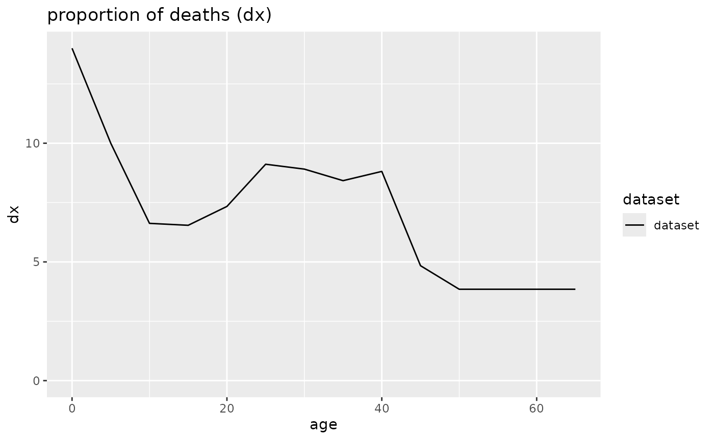

# Life table correction

## Load libraries

``` r
library(mortAAR)
library(magrittr)
```

## Smoothing of data

Due to the nature of most anthropological ageing methods, life tables
from archaeological series often contain artificial jumps in the data.
To counteract this effect, mortAAR provides the option to interpolate
values for adults by a monotonic cubic spline. Usual options will by
‘10’, ‘15’ or ‘20’ which will interpolate the values for individuals of
an age of 20 or older by 10-, 15- or 20-year cumulated values. This is
to be used carefully, as diagnostic features of the life table might be
smoothed and essentially removed. This option is only available when the
methods `Standard` or `Equal5` in `prep.life.table` have been chosen.

As an example, we work with the Early Neolithic cemetery of Nitra.
First, we prepare the data, calculate the life table and plot d_(x)- and
q_(x)-diagrams. The age-classes 25-44 show a bimodal distribution which
might be artificial. Furthermore, the curve sharply drops after 40 which
also looks very unnatural.

``` r
nitra_prep <- prep.life.table(nitra, method="Equal5", agebeg = "age_start", ageend = "age_end")
nitra_life <- life.table(nitra_prep)
plot(nitra_life, display=c("dx","qx"))
```



Next we test how the plot changes if the spline-option with 10 and 20
years is chosen. In both cases, the smoothing is only applied to the age
groups 20 and above.

``` r
nitra_life <- life.table(nitra_prep,option_spline = 10)
plot(nitra_life, display=c("dx","qx"))
```


``` r
nitra_life <- life.table(nitra_prep,option_spline = 20)
plot(nitra_life, display=c("dx","qx"))
```


As expected, applying the option leads to much smoother curves. However,
for the 10-year-option, the oldest age group shows a local maximum which
is not reflected in the original data and therefore is an artefact of
the smoothing algorithm working on the available data. In this case, the
20-year-option seems to offer a better compromise between a much more
natural looking curve and still trueness to the original data.

## Representativeness of data

Anthropological data from archaeological contexts is necessarily
fragmentary. The question remains if this fragmentation leads to
completely unreliable inferences when statistical methods are applied to
it. K. M. Weiss (1973, 46f.) and C. Masset and J.-P. Bocquet-Appel
(1977; see also Herrmann et al. 1990, 306f.) have therefore devised
indices which check if the non-adult age groups are represented in
proportions as can be expected from modern comparable data. Whether this
is really applicable to archaeological data-sets is a matter of debate.

Weiss chose the mortality (q_(x)) as deciding factor and claimed that
(1) the probability of death of the age group 10-15 (₅q₁₀) should be
lower than that of the group 15-20 (₅q₁₅) and that (2) the latter in
turn should be lower than that of age group 0-5 (₅q₀).

In contrast, Bocquet-Appel and Masset took the raw number of dead
(D_(x)) and asserted that (1) the ratio of those having died between 5
and 10 (D₅₋₁₀) and those died between 10 and 15 years (D₁₀₋₁₅) should be
equal or larger than 2 and that (2) the ratio of those having died
between 5 and 15 (D₅₋₁₅) and all adults (\>= 20; D₂₀₊) should be 0.1 or
larger.

If either of these prerequisites is not met, the results from such data
should be treated with extreme caution as the mortality structure is
different from that of known populations. Due to the specific nature of
the indices, they only give meaningful results if 5-year-age categories
have been chosen for the non-adults.

Quite recently, B. Taylor and M. Oxenham (2024) added a comparison of
Total fertility rates (TRF) according to different formulas which depend
either on subadults or adults. The formualas Taylor and Oxenham used
either weigh all individuals aged 0–14 against all individuals or all
individuals aged 15–49 against all individuals aged 15+. The formulas
differ from the original ones published by C. McFadden and M. Oxenham
(2018) and B. Taylor et al. (2023) because the data basis is slighty
different. If the results of the formulas deviate by more than 0.692
(the standard error of estimate, SEE), they conclude that there is a
problem with the age structure. In contrast to the tests by Weiss and
Masset and Bocquet-Appel, there is no need to divide the sample into
5-year-steps, as long as the limits at 15 and 50 years are respected.

As example, we use the data-set of the medieval cemetery of Schleswig.

``` r
schleswig <- life.table(schleswig_ma[c("a", "Dx")])
lt.representativity(schleswig)
```

    ##     approach            condition value1 value2 result outcome
    ## 1   weiss_i1           5q0 > 5q15  20.24   4.91   4.12    TRUE
    ## 2   weiss_i2          5q10 < 5q15   6.86   4.91   1.40   FALSE
    ## 3    child_i    (5D5 / 5D10) >= 2  22.00  12.00   1.83   FALSE
    ## 4 juvenile_i (10D5 / D20+) >= 0.1  34.00 155.00   0.22    TRUE
    ## 5        TFR       TFR_SA = TFR_A   4.83   6.99   2.16   FALSE

The result is a dataframe where the individual conditions with the
actual results are listed. The last column provides the verdict if the
respective condition is met or not. In the case of the Schleswig
cemetery, only the Weiss criterium (1) and the Bocquet-Appel/Masset
criterium (2) is `TRUE`, the other three are `FALSE`. Therefore, it can
be argued that the Schleswig data is not representative of a complete
once-living population. However, it might be that the
Bocquet-Appel/Masset criterium (1) is too conservative as only two
individuals would have to have died at this age to bring the ratio above
2 (Herrmann et al. 1990, 307). P. Sellier (1989, 23) has even argued
that the ratio should be 1.5 instead of 2. In this case, both criteria
of Bocquet-Appel and Masset would be met for the Schleswig cemetery.

## Correction of life table data after Bocquet-Appel and Masset

It is generally assumed that most skeletal populations lack the youngest
age group. Life tables resulting from such populations will necessarily
be misleading as they lead to believe that the mortality of younger
children was lower than it actually was and that life expectancy was
higher. For correcting these missing individuals, Masset and
Bocquet-Appel (1977; see also Herrmann et al. 1990, 307) conceived of
several calculations based on regression analyses of modern comparable
mortality data. Despite the fact that these recommendations are more
than 40 years old, they still surface in text books (e. g. Grupe,
Harbeck, and McGlynn 2015, 418–19). However, the applicability of these
indices to archaeological data is debatable and does not necessarily
lead to reliable results. Therefore, the correction needs to be weighted
carefully and ideally only after the representativeness of the base data
has been checked with function `lt.representativity`.

The equations conceived by Masset and Bocquet-Appel are relatively
complex. Life expectancy at the time of birth is computed as follows:

$e_{x}^{0} = 78.721*log_{10}\sqrt{\frac{D_{20 +}}{D_{5 - 14}}} - 3.384 \pm 1.503$

The equation will strive towards 75 years of life expectancy when there
is a ratio of adults to 5–14-year old of 100 to 1 as the term
$log_{10}\sqrt{\frac{D_{20 +}}{D_{5 - 14}}})$ will then tend towards 1.
Higher numbers of non-adults will likewise lead to lower life expectancy
values.

The probability of death in the first and the first five years is
similarly constructed:

$_{1}q_{0} = 0.568*\sqrt{log_{10}(\frac{200*D_{5 - 14}}{D_{20 +}}}) - 0.438 \pm 0.016$

$_{5}q_{0} = 1.154*\sqrt{log_{10}(\frac{200*D_{5 - 14}}{D_{20 +}}}) - 1.014 \pm 0.041$

The corrected Schleswig data[¹](#fn1) are as follows:

``` r
schleswig <- life.table(schleswig_ma[c("a", "Dx")])
lt.correction(schleswig)
```

    ## $indices
    ##   method  value range_start range_end
    ## 1     e0 22.549      21.046    24.052
    ## 2    1q0  0.290       0.274     0.306
    ## 3    5q0  0.465       0.424     0.506
    ## 
    ## $life_table_corr
    ## 
    ##   mortAAR life table (n = 368.1 individuals)
    ## 
    ## Life expectancy at birth (e0): 21.129
    ## 
    ##         x a    Ax      Dx     dx      lx      qx      Lx       Tx     ex
    ## 1    0--4 5 1.667 171.102 46.482 100.000  46.482 345.059 2112.914 21.129
    ## 2    5--9 5 2.500  22.000  5.977  53.518  11.168 252.648 1767.854 33.033
    ## 3  10--14 5 2.500  12.000  3.260  47.541   6.857 229.556 1515.207 31.871
    ## 4  15--19 5 2.500   8.000  2.173  44.281   4.908 215.973 1285.650 29.034
    ## 5  20--26 7 3.500  15.000  4.075  42.108   9.677 280.493 1069.677 25.403
    ## 6  27--33 7 3.500  30.000  8.150  38.033  21.429 237.706  789.184 20.750
    ## 7  34--40 7 3.500  12.000  3.260  29.883  10.909 197.771  551.478 18.455
    ## 8  41--47 7 3.500  19.000  5.162  26.623  19.388 168.296  353.707 13.286
    ## 9  48--54 7 3.500  36.000  9.780  21.461  45.570 116.001  185.411  8.639
    ## 10 55--61 7 3.500  28.000  7.607  11.682  65.116  55.148   69.410  5.942
    ## 11 62--68 7 3.500  15.000  4.075   4.075 100.000  14.262   14.262  3.500
    ##    rel_popx
    ## 1    16.331
    ## 2    11.957
    ## 3    10.864
    ## 4    10.222
    ## 5    13.275
    ## 6    11.250
    ## 7     9.360
    ## 8     7.965
    ## 9     5.490
    ## 10    2.610
    ## 11    0.675

Apart from the corrected life table, it also lists – as separate
data.frame – the indices ($e^{0}$, $_{1}q_{0}$ and $_{5}q_{0}$) computed
by the formulas of Masset and Bocquet-Appel. Compare this to the
uncorrected values:

``` r
life.table(schleswig_ma[c("a", "Dx")])
```

    ## 
    ##   mortAAR life table (n = 247 individuals)
    ## 
    ## Life expectancy at birth (e0): 30.671
    ## 
    ##         x a    Ax Dx     dx      lx      qx      Lx       Tx     ex rel_popx
    ## 1    0--4 5 1.667 50 20.243 100.000  20.243 432.524 3067.139 30.671   14.102
    ## 2    5--9 5 2.500 22  8.907  79.757  11.168 376.518 2634.615 33.033   12.276
    ## 3  10--14 5 2.500 12  4.858  70.850   6.857 342.105 2258.097 31.871   11.154
    ## 4  15--19 5 2.500  8  3.239  65.992   4.908 321.862 1915.992 29.034   10.494
    ## 5  20--26 7 3.500 15  6.073  62.753   9.677 418.016 1594.130 25.403   13.629
    ## 6  27--33 7 3.500 30 12.146  56.680  21.429 354.251 1176.113 20.750   11.550
    ## 7  34--40 7 3.500 12  4.858  44.534  10.909 294.737  821.862 18.455    9.610
    ## 8  41--47 7 3.500 19  7.692  39.676  19.388 250.810  527.126 13.286    8.177
    ## 9  48--54 7 3.500 36 14.575  31.984  45.570 172.874  276.316  8.639    5.636
    ## 10 55--61 7 3.500 28 11.336  17.409  65.116  82.186  103.441  5.942    2.680
    ## 11 62--68 7 3.500 15  6.073   6.073 100.000  21.255   21.255  3.500    0.693

With the uncorrected data, the youngest age group (years 0–4) ‘only’
comprises around 20% of the population. However, according to the
formulas by Masset and Bocquet-Appel, this number should be more than
doubled (46%). This would mean that in reality nearly 50% of the
individuals died before they reached their 5^(th) birthday. Applying
this value to the life table, the number of individuals increases from
247 to 368 and at the same time the life expectancy at birth decreases
from 30.7 to 21.1 years. Please note that this value differs somehow
from that which is computed by the formula by Masset and Bocquet-Appel
(22.5 years). This is easily explainable as the life expectancy of the
life table includes *all* individuals. However, the value of 21.1 years
is still in the range of 21.0 to 24.1 years (see indices) given by
Masset and Bocquet-Appel.

``` r
lt.representativity(lt.correction(schleswig)$life_table_corr)
```

    ##     approach            condition value1 value2 result outcome
    ## 1   weiss_i1           5q0 > 5q15  46.48   4.91   9.47    TRUE
    ## 2   weiss_i2          5q10 < 5q15   6.86   4.91   1.40   FALSE
    ## 3    child_i    (5D5 / 5D10) >= 2  22.00  12.00   1.83   FALSE
    ## 4 juvenile_i (10D5 / D20+) >= 0.1  34.00 155.00   0.22    TRUE
    ## 5        TFR       TFR_SA = TFR_A   6.40   6.99   0.60    TRUE

Because the correction only applies to the youngest age group, it has no
effects on the tests for representativeness by Weiss and Masset and
Bocquet-Appel. The correction, however, affects the test by Taylor et
al. Now, the Total fertility rate based on the subadult index is much
closer to the value computed from the individuals aged 15 and above. As
the difference is below 0.692, the test now would not suspect a biased
population. This might be taken as hint that the ‘true’ TFR-value is
closer to 7 than to 4 and that the correction by Masset and
Bocquet-Appel was both necessary and arrived at good estimates.

## References

Grupe, Gisela, Michaela Harbeck, and George C. McGlynn. 2015.
*Prähistorische Anthropologie*. Berlin, Heidelberg: Springer.

Herrmann, B., G. Grupe, S. Hummel, H. Piepenbrink, and H. Schutkowski.
1990. *Praehistorische Anthropologie: Leitfaden Der Feld- Und
Labormethoden*. Berlin: Springer.

Masset, Claude, and Jean-Pierre Bocquet. 1977. “Estimateurs En
Paléodémographie.” *L’Homme* 17 (4): 65–90.

McFadden, Clare, and Marc F. Oxenham. 2018. “The D0-14/D ratio: A new
paleodemographic index and equation for estimating total fertility
rates.” *American Journal of Physical Anthropology* 165 (3): 471–79.

Sellier, Pascal. 1989. “Hypotheses and Estimators for the Demographic
Interpretation of the Chalcolithic Population from Mehrgarh, Pakistan.”
*East and West* 39 (1/4): 11–42.

Taylor, B. R., M. Oxenham, and C. McFadden. 2023. “Estimating fertility
using adults: A method for under-enumerated pre-adult skeletal samples.”
*American Journal of Biological Anthropology* 181 (2): 262–70.
<https://doi.org/10.1002/ajpa.24739>.

Taylor, Bonnie R., and Marc F. Oxenham. 2024. “A method for detecting
bias in human archaeological cemetery samples.” *International Journal
of Osteoarchaeology*, 0. <https://doi.org/10.1002/oa.3379>.

Weiss, Kenneth M., and H. Martin Wobst. 1973. “Demographic Models for
Anthropology.” *Memoirs of the Society for American Archaeology* 27:
i–186.

------------------------------------------------------------------------

1.  The values differ from that published by Herrmann et al. (1990, 307)
    because here no correction of the age group 5–10 years was applied.
