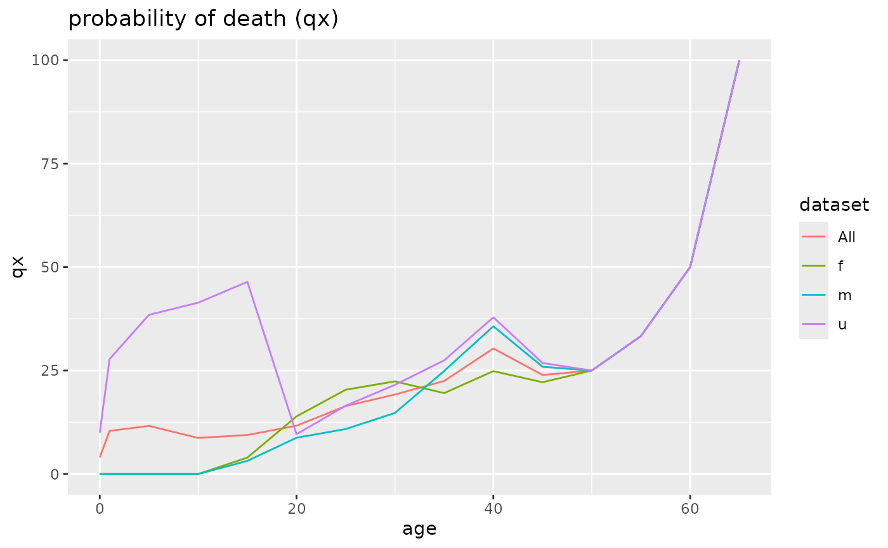
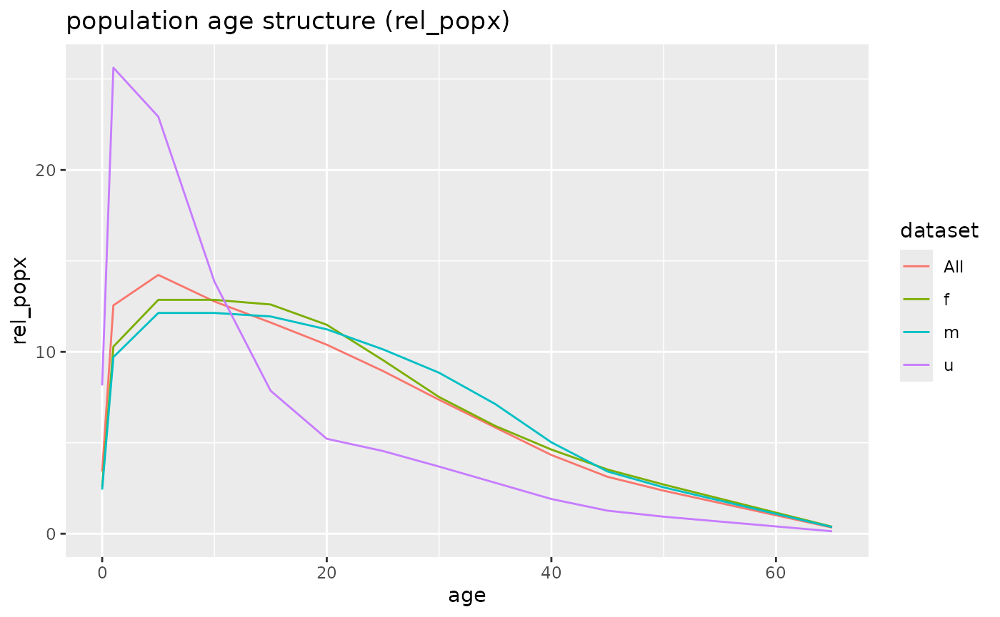
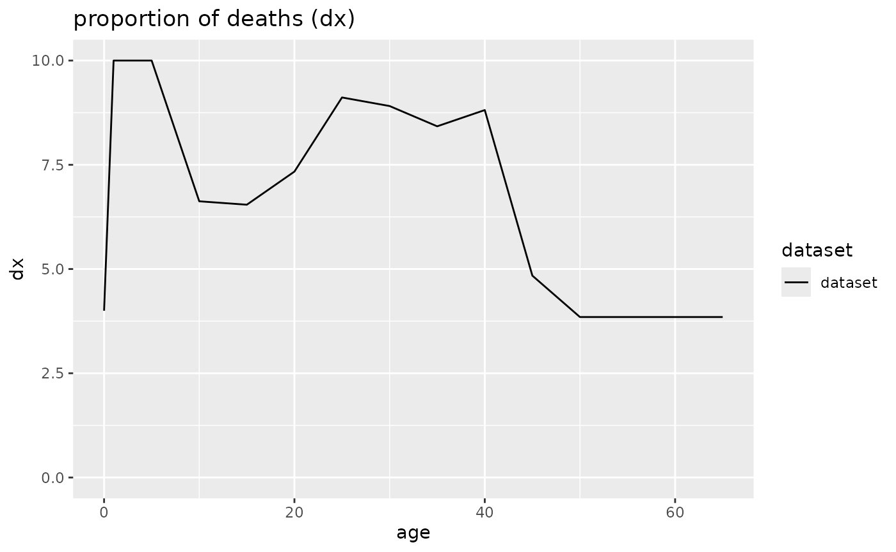

# Introduction to mortAAR

**mortAAR** is supposed to ease the import and display of archaeological
life table data as well as to offer more advanced functions. The general
idea behind life tables and the implementation in mortAAR is explained
in the
[`vignette("background")`](https://isaakiel.github.io/mortAAR/articles/background.md).
This introduction gets you started with the import of different data
sets, the computation of life tables and finally the plotting of life
tables.

## Import of data

The import of data is controlled by the function
`mortAAR::prep.life.tabe()`. In most cases, the data set will contain
one row per individual with the respective age ranges, similar to the
example of the cemetery of Nitra.

``` r
library(mortAAR)
library(magrittr)

head(mortAAR::nitra)
```

    ##   X  no sex age_start age_end
    ## 1 1   1   f        20      25
    ## 2 2   2   m        36      45
    ## 3 3   3   u        13      17
    ## 4 4 4_1   u        13      17
    ## 5 5 4_2   f        26      35
    ## 6 6 4_3   m        36      45

``` r
nitra_prep <- prep.life.table(nitra, group = "sex", agebeg = "age_start", ageend = "age_end", agerange = "included")
```

Please note that the data set has an ID column (`no`), a grouping column
with the sex of the individuals as well as two columns containing the
start and end of the age ranges. The end age is “inclusive” which means
that there are no overlaps between the age categories.

In other cases, the data might already have been aggregated, e. g. in a
published life table as in the example Aiterhofen-Ödmühlen.

``` r
head(mortAAR::aiterhofen_oedmuehlen)
```

    ##   Alter a    Dx        Sx       qx        lx        dx       Lx        Tx
    ## 1     0 5  4.20 107.00000 0.039252 1000.0000  39.25233 4901.869 26773.570
    ## 2     5 5  4.26 102.80000 0.041504  960.7476  39.87538 4704.049 21871.700
    ## 3    10 5  8.67  98.53333 0.088018  920.8722  81.05352 4401.727 17167.650
    ## 4    15 5 14.20  89.86060 0.158022  839.8187 132.71020 3867.318 12765.930
    ## 5    20 5 14.73  75.66060 0.194809  707.1084 137.75130 3191.163  8898.612
    ## 6    25 5 17.37  60.92121 0.285216  569.3571 162.39020 2440.809  5707.448
    ##         ex  rel.Bevx
    ## 1 26.77357 18.308600
    ## 2 22.76529 17.569740
    ## 3 18.64282 16.440560
    ## 4 15.20081 14.444530
    ## 5 12.58450 11.919070
    ## 6 10.02437  9.116488

``` r
aiterhofen_prep <- mortAAR::prep.life.table(aiterhofen_oedmuehlen, dec = "Dx", agebeg = "Alter", method = "Equal5")
```

In this case, the column with the number of deceased (`dec`) has to be
named and the method of aggregation has to be changed to `Equal5` as no
differentiation is made in the youngest age category.

## Displaying the life table

If the data has been prepared as above, it is easy to generate a life
table with the command
[`life.table()`](https://isaakiel.github.io/mortAAR/reference/life.table.md).

``` r
mortAAR::life.table(aiterhofen_prep)
```

    ## 
    ##   mortAAR life table (n = 106.49 individuals)
    ## 
    ## Life expectancy at birth (e0): 26.584
    ## 
    ##         x a    Ax    Dx     dx      lx      qx      Lx       Tx     ex rel_popx
    ## 1    0--4 5 1.667  4.20  3.944 100.000   3.944 486.853 2658.442 26.584   18.313
    ## 2    5--9 5 2.500  4.26  4.000  96.056   4.165 470.279 2171.589 22.608   17.690
    ## 3  10--14 5 2.500  8.67  8.142  92.056   8.844 439.924 1701.310 18.481   16.548
    ## 4  15--19 5 2.500 14.20 13.335  83.914  15.891 386.233 1261.386 15.032   14.529
    ## 5  20--24 5 2.500 14.73 13.832  70.579  19.598 318.316  875.153 12.400   11.974
    ## 6  25--29 5 2.500 17.37 16.311  56.747  28.744 242.957  556.836  9.813    9.139
    ## 7  30--34 5 2.500 18.12 17.016  40.436  42.081 159.639  313.879  7.762    6.005
    ## 8  35--39 5 2.500 12.46 11.701  23.420  49.960  87.849  154.240  6.586    3.305
    ## 9  40--44 5 2.500  6.78  6.367  11.719  54.327  42.680   66.391  5.665    1.605
    ## 10 45--49 5 2.500  3.95  3.709   5.353  69.298  17.490   23.711  4.430    0.658
    ## 11 50--54 5 2.500  1.30  1.221   1.643  74.286   5.165    6.221  3.786    0.194
    ## 12 55--59 5 2.500  0.45  0.423   0.423 100.000   1.056    1.056  2.500    0.040

For plotting the resulting life table indices, it is advisable to store
the results. If a grouping variable had been specified, a separate life
table is generated for each group.

``` r
nitra_lt <- mortAAR::life.table(nitra_prep)
nitra_lt
```

    ## 
    ## 
    ##   mortAAR life table for sex: f (n = 27 individuals)
    ## 
    ## Life expectancy at birth (e0): 38.882
    ## 
    ##         x a    Ax    Dx     dx      lx      qx      Lx       Tx     ex rel_popx
    ## 1    0--0 1 0.333 0.000  0.000 100.000   0.000 100.000 3888.230 38.882    2.572
    ## 2    1--4 4 1.333 0.000  0.000 100.000   0.000 400.000 3788.230 37.882   10.287
    ## 3    5--9 5 2.500 0.000  0.000 100.000   0.000 500.000 3388.230 33.882   12.859
    ## 4  10--14 5 2.500 0.000  0.000 100.000   0.000 500.000 2888.230 28.882   12.859
    ## 5  15--19 5 2.500 1.071  3.968 100.000   3.968 490.079 2388.230 23.882   12.604
    ## 6  20--24 5 2.500 3.612 13.377  96.032  13.930 446.715 1898.151 19.766   11.489
    ## 7  25--29 5 2.500 4.545 16.834  82.654  20.367 371.186 1451.436 17.560    9.546
    ## 8  30--34 5 2.500 3.979 14.735  65.820  22.387 292.262 1080.250 16.412    7.517
    ## 9  35--39 5 2.500 2.696  9.986  51.085  19.548 230.458  787.988 15.425    5.927
    ## 10 40--44 5 2.500 2.759 10.218  41.099  24.863 179.947  557.529 13.566    4.628
    ## 11 45--49 5 2.500 1.849  6.850  30.880  22.182 137.277  377.582 12.227    3.531
    ## 12 50--54 5 2.500 1.622  6.008  24.031  25.000 105.133  240.305 10.000    2.704
    ## 13 55--59 5 2.500 1.622  6.008  18.023  33.333  75.095  135.172  7.500    1.931
    ## 14 60--64 5 2.500 1.622  6.008  12.015  50.000  45.057   60.076  5.000    1.159
    ## 15 65--69 5 2.500 1.622  6.008   6.008 100.000  15.019   15.019  2.500    0.386
    ## 
    ##   mortAAR life table for sex: m (n = 18 individuals)
    ## 
    ## Life expectancy at birth (e0): 41.192
    ## 
    ##         x a    Ax    Dx     dx      lx      qx      Lx       Tx     ex rel_popx
    ## 1    0--0 1 0.333 0.000  0.000 100.000   0.000 100.000 4119.151 41.192    2.428
    ## 2    1--4 4 1.333 0.000  0.000 100.000   0.000 400.000 4019.151 40.192    9.711
    ## 3    5--9 5 2.500 0.000  0.000 100.000   0.000 500.000 3619.151 36.192   12.138
    ## 4  10--14 5 2.500 0.000  0.000 100.000   0.000 500.000 3119.151 31.192   12.138
    ## 5  15--19 5 2.500 0.571  3.175 100.000   3.175 492.063 2619.151 26.192   11.946
    ## 6  20--24 5 2.500 1.529  8.492  96.825   8.770 462.897 2127.087 21.968   11.238
    ## 7  25--29 5 2.500 1.729  9.603  88.333  10.872 417.659 1664.190 18.840   10.139
    ## 8  30--34 5 2.500 2.091 11.617  78.730  14.756 364.608 1246.532 15.833    8.852
    ## 9  35--39 5 2.500 3.009 16.715  67.113  24.906 293.778  881.924 13.141    7.132
    ## 10 40--44 5 2.500 3.238 17.990  50.398  35.695 207.016  588.146 11.670    5.026
    ## 11 45--49 5 2.500 1.512  8.400  32.408  25.918 141.043  381.130 11.760    3.424
    ## 12 50--54 5 2.500 1.080  6.002  24.009  25.000 105.038  240.087 10.000    2.550
    ## 13 55--59 5 2.500 1.080  6.002  18.007  33.333  75.027  135.049  7.500    1.821
    ## 14 60--64 5 2.500 1.080  6.002  12.004  50.000  45.016   60.022  5.000    1.093
    ## 15 65--69 5 2.500 1.080  6.002   6.002 100.000  15.005   15.005  2.500    0.364
    ## 
    ##   mortAAR life table for sex: u (n = 30 individuals)
    ## 
    ## Life expectancy at birth (e0): 11.448
    ## 
    ##         x a    Ax    Dx     dx      lx      qx      Lx       Tx     ex rel_popx
    ## 1    0--0 1 0.333 3.000 10.000 100.000  10.000  93.333 1144.791 11.448    8.153
    ## 2    1--4 4 1.333 7.500 25.000  90.000  27.778 293.333 1051.458 11.683   25.623
    ## 3    5--9 5 2.500 7.500 25.000  65.000  38.462 262.500  758.124 11.663   22.930
    ## 4  10--14 5 2.500 4.968 16.561  40.000  41.404 158.596  495.624 12.391   13.854
    ## 5  15--19 5 2.500 3.264 10.881  23.439  46.423  89.991  337.028 14.379    7.861
    ## 6  20--24 5 2.500 0.362  1.208  12.558   9.621  59.768  247.037 19.672    5.221
    ## 7  25--29 5 2.500 0.562  1.875  11.350  16.519  52.061  187.269 16.500    4.548
    ## 8  30--34 5 2.500 0.612  2.041   9.475  21.547  42.270  135.209 14.270    3.692
    ## 9  35--39 5 2.500 0.612  2.041   7.433  27.464  32.062   92.939 12.503    2.801
    ## 10 40--44 5 2.500 0.612  2.041   5.392  37.863  21.855   60.876 11.291    1.909
    ## 11 45--49 5 2.500 0.270  0.899   3.350  26.822  14.505   39.021 11.647    1.267
    ## 12 50--54 5 2.500 0.184  0.613   2.452  25.000  10.726   24.516 10.000    0.937
    ## 13 55--59 5 2.500 0.184  0.613   1.839  33.333   7.661   13.790  7.500    0.669
    ## 14 60--64 5 2.500 0.184  0.613   1.226  50.000   4.597    6.129  5.000    0.402
    ## 15 65--69 5 2.500 0.184  0.613   0.613 100.000   1.532    1.532  2.500    0.134
    ## 
    ##   mortAAR life table for sex: All (n = 75 individuals)
    ## 
    ## Life expectancy at birth (e0): 28.463
    ## 
    ##         x a    Ax    Dx     dx      lx      qx      Lx       Tx     ex rel_popx
    ## 1    0--0 1 0.333 3.000  4.000 100.000   4.000  97.333 2846.275 28.463    3.420
    ## 2    1--4 4 1.333 7.500 10.000  96.000  10.417 357.333 2748.942 28.635   12.554
    ## 3    5--9 5 2.500 7.500 10.000  86.000  11.628 405.000 2391.609 27.809   14.229
    ## 4  10--14 5 2.500 4.968  6.625  76.000   8.717 363.439 1986.609 26.140   12.769
    ## 5  15--19 5 2.500 4.907  6.543  69.375   9.431 330.520 1623.170 23.397   11.612
    ## 6  20--24 5 2.500 5.503  7.337  62.833  11.677 295.820 1292.650 20.573   10.393
    ## 7  25--29 5 2.500 6.836  9.115  55.495  16.425 254.689  996.830 17.962    8.948
    ## 8  30--34 5 2.500 6.682  8.909  46.380  19.210 209.628  742.141 16.001    7.365
    ## 9  35--39 5 2.500 6.317  8.423  37.471  22.479 166.297  532.513 14.211    5.843
    ## 10 40--44 5 2.500 6.610  8.813  29.048  30.339 123.207  366.216 12.607    4.329
    ## 11 45--49 5 2.500 3.631  4.841  20.235  23.925  89.072  243.009 12.009    3.129
    ## 12 50--54 5 2.500 2.886  3.848  15.394  25.000  67.348  153.937 10.000    2.366
    ## 13 55--59 5 2.500 2.886  3.848  11.545  33.333  48.105   86.590  7.500    1.690
    ## 14 60--64 5 2.500 2.886  3.848   7.697  50.000  28.863   38.484  5.000    1.014
    ## 15 65--69 5 2.500 2.886  3.848   3.848 100.000   9.621    9.621  2.500    0.338

## Plotting the results

A complete set of all indices of the life table is generated with the
command
[`plot()`](https://isaakiel.github.io/mortAAR/reference/plot.md). The
lines of the groups (if specified) are displayed as line types (default)
or with different colours.

``` r
plot(nitra_lt, line_vis = "colour")
```



It is, of course, also possible to address the life tables individually
to only display or plot a subset. It is also possible to limit the plots
to certain types.

``` r
plot(nitra_lt$All, display = "dx")
```



If more control is desired, for example to create customized plots in
[`ggplot2::ggplot()`](https://ggplot2.tidyverse.org/reference/ggplot.html),
this is also possible. The following takes the life tables from the
Nitra example and creates a ggplot diagram with combinations of line
types and colours. Please note how the x-axis is created with the column
`a` from the life table which contains the length of each age class.

``` r
library(ggplot2)
ggplot(nitra_lt$All, aes(x=c(0,cumsum(a)[-nrow(nitra_lt$All)]), y=dx)) +
 geom_point() +
 geom_line(aes(col = "All")) +
 scale_x_continuous(breaks=seq(0, 70, 10)) +
 labs(title="Nitra", x = "age", y = "dx") +
 geom_line(data=nitra_lt$m, aes(col= "male"), linewidth=1.2, linetype="dashed") +
 geom_line(data=nitra_lt$f, aes(col= "female"), linewidth=1.2, linetype="dotted") +
 scale_colour_manual(values = c("black", "blue","red")) + theme_light() +
 theme( legend.title = element_blank())
```


## Going further

Hopefully, the above has succeeded in giving an overview how to use the
basic functions of mortAAR. Two further worked examples can be found in
the
[`vignette("example_1")`](https://isaakiel.github.io/mortAAR/articles/example_1.md)
and
[`vignette("example_2")`](https://isaakiel.github.io/mortAAR/articles/example_2.md).
The former deals especially with data preparation while the latter also
covers the use case to combine two life tables in a joined analysis.

More advanced functions of mortAAR deal with testing the
representativeness and the subsequent correction of life tables
(explained in the
[`vignette("lt_correction")`](https://isaakiel.github.io/mortAAR/articles/lt_correction.md))
as well as the computation of reproduction indices
([`vignette("reproduction")`](https://isaakiel.github.io/mortAAR/articles/reproduction.md)).
