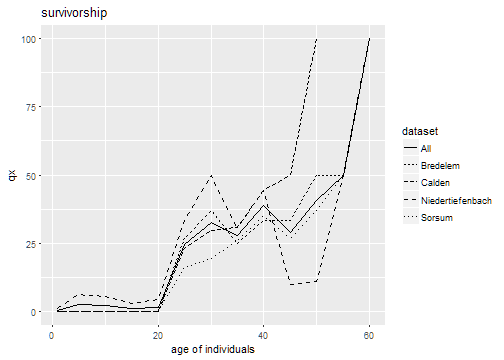
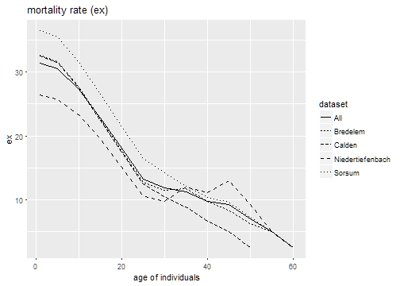
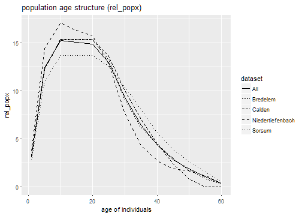

# Load libraries


```r
library(mortAAR)
library(tidyverse)
```

# Make test data available

Data from four neolithic gallery graves in central Germany [@czarnetzki_menschlichen_1966].


```r
td <- gallery_graves
```

Inspect the data. Show the first ten rows of the data set:


|indnr |sex |age    |site             |
|:-----|:---|:------|:----------------|
|107   |?   |3-5    |Niedertiefenbach |
|133   |?   |6-8    |Niedertiefenbach |
|6     |?   |inf_I  |Niedertiefenbach |
|38    |?   |inf_I  |Niedertiefenbach |
|142   |?   |inf_I  |Niedertiefenbach |
|141   |?   |inf_II |Niedertiefenbach |
|145   |?   |inf_II |Niedertiefenbach |
|24    |?   |juv    |Niedertiefenbach |
|139   |w   |<60    |Niedertiefenbach |
|110,1 |m   |?      |Niedertiefenbach |

# Clean up data

Replace: "?" with `NA` values


```r
td %>% replace(td == "?", NA) -> td
```


|indnr |sex |age    |site             |
|:-----|:---|:------|:----------------|
|107   |NA  |3-5    |Niedertiefenbach |
|133   |NA  |6-8    |Niedertiefenbach |
|6     |NA  |inf_I  |Niedertiefenbach |
|38    |NA  |inf_I  |Niedertiefenbach |
|142   |NA  |inf_I  |Niedertiefenbach |
|141   |NA  |inf_II |Niedertiefenbach |
|145   |NA  |inf_II |Niedertiefenbach |
|24    |NA  |juv    |Niedertiefenbach |
|139   |w   |<60    |Niedertiefenbach |
|110,1 |m   |NA     |Niedertiefenbach |

Translate "inf_I", "inf_I" and "juv" into numeric age ranges [@martin_lehrbuch_1928, pp. 580].


```r
td <- td %>% 
  replace(td == "inf_I",  "0-6") %>%
  replace(td == "inf_II", "7-13") %>%
  replace(td == "juv",    "14-19")
```


|indnr |sex |age   |site             |
|:-----|:---|:-----|:----------------|
|107   |NA  |3-5   |Niedertiefenbach |
|133   |NA  |6-8   |Niedertiefenbach |
|6     |NA  |0-6   |Niedertiefenbach |
|38    |NA  |0-6   |Niedertiefenbach |
|142   |NA  |0-6   |Niedertiefenbach |
|141   |NA  |7-13  |Niedertiefenbach |
|145   |NA  |7-13  |Niedertiefenbach |
|24    |NA  |14-19 |Niedertiefenbach |
|139   |w   |<60   |Niedertiefenbach |
|110,1 |m   |NA    |Niedertiefenbach |

Remove rows that do not have age information.


```r
td <- td %>%
  dplyr::filter(!is.na(age))
```


|indnr |sex |age   |site             |
|:-----|:---|:-----|:----------------|
|107   |NA  |3-5   |Niedertiefenbach |
|133   |NA  |6-8   |Niedertiefenbach |
|6     |NA  |0-6   |Niedertiefenbach |
|38    |NA  |0-6   |Niedertiefenbach |
|142   |NA  |0-6   |Niedertiefenbach |
|141   |NA  |7-13  |Niedertiefenbach |
|145   |NA  |7-13  |Niedertiefenbach |
|24    |NA  |14-19 |Niedertiefenbach |
|139   |w   |<60   |Niedertiefenbach |
|124   |w   |18-20 |Niedertiefenbach |

Make a decision about individual 139 from Niedertiefenbach with age less equal 60. 


```r
td[td$indnr == "139" & td$site == "Niedertiefenbach", ]$age <- "50-60"
```


|indnr |sex |age   |site             |
|:-----|:---|:-----|:----------------|
|107   |NA  |3-5   |Niedertiefenbach |
|133   |NA  |6-8   |Niedertiefenbach |
|6     |NA  |0-6   |Niedertiefenbach |
|38    |NA  |0-6   |Niedertiefenbach |
|142   |NA  |0-6   |Niedertiefenbach |
|141   |NA  |7-13  |Niedertiefenbach |
|145   |NA  |7-13  |Niedertiefenbach |
|24    |NA  |14-19 |Niedertiefenbach |
|139   |w   |50-60 |Niedertiefenbach |
|124   |w   |18-20 |Niedertiefenbach |

Separate the age range column.


```r
td <- td %>%
  tidyr::separate(age, c("from", "to"))
```


|indnr |sex |from |to |site             |
|:-----|:---|:----|:--|:----------------|
|107   |NA  |3    |5  |Niedertiefenbach |
|133   |NA  |6    |8  |Niedertiefenbach |
|6     |NA  |0    |6  |Niedertiefenbach |
|38    |NA  |0    |6  |Niedertiefenbach |
|142   |NA  |0    |6  |Niedertiefenbach |
|141   |NA  |7    |13 |Niedertiefenbach |
|145   |NA  |7    |13 |Niedertiefenbach |
|24    |NA  |14   |19 |Niedertiefenbach |
|139   |w   |50   |60 |Niedertiefenbach |
|124   |w   |18   |20 |Niedertiefenbach |

Adjust variable types.


```r
td <- td %>%
  transform(
    from = as.numeric(from),
    to = as.numeric(to)
  )
```

# Analysis preparation

Control the flow of analysis by exemplifying what the different variables of the input data stand for.


```r
# tdlist <- td %>%
#   plyr::dlply("site", identity)

td_prepared <- prep.life.table(
  td, 
  dec = "NA", 
  agebeg = "from",
  ageend = "to", 
  grnam = "site", 
  methode = "Standard",
  age.range = "excluded"
)
```

# Analysis


```r
td_result <- td_prepared %>%
  life.table()
```

# Plot


```r
td_result %>% plot(display = c("qx", "ex", "rel_popx"))
```

```
## Warning: Removed 2 rows containing missing values (geom_path).
```



```
## Warning: Removed 2 rows containing missing values (geom_path).
```



# References
